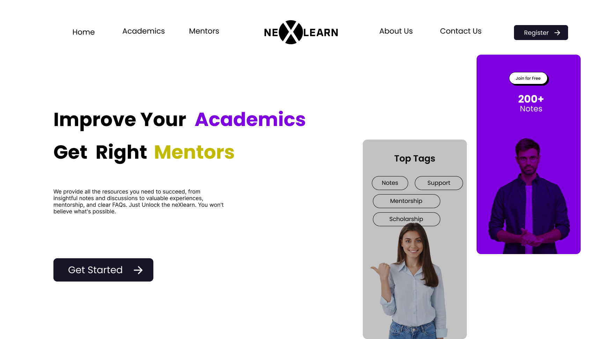
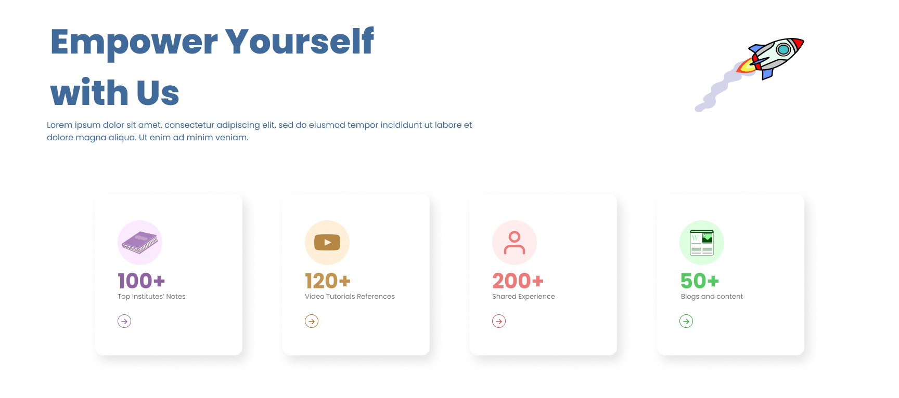

# neXlearn

## Empower Your Journey with neXlearn

Welcome to neXlearn, where we unlock the full potential of your learning journey! Our platform is dedicated to providing you with all the resources necessary for success. From insightful notes and engaging discussions to valuable experiences and mentorship, we've got you covered. Plus, with our **clear and comprehensive FAQs, you'll never feel lost.

---

## Features

- Insightful Notes: Dive into our extensive library of notes that cover a wide range of topics, curated and refined to enhance your understanding.
- Engaging Discussions: Join the community discussions. Share your insights and learn from the collective wisdom of your peers.
- Valuable Experiences: Gain real-world experience through projects, internships, and mentorship programs that prepare you for your future career.
- Comprehensive Mentorship: Connect with industry experts and mentors who can guide you through your learning journey.
- Clear FAQs: Have a question? Our FAQs section provides clear and concise answers to help you navigate our platform with ease.

---

## Technologies Used

Our platform is built with the latest technologies to ensure a seamless and efficient learning experience:

- Node.js & npm: For server-side logic and managing project dependencies.
- React.js: A powerful JavaScript library for building user interfaces with high performance.
- Firebase: Used for database management, authentication, and hosting services.
- Tailwind CSS: A utility-first CSS framework for rapid UI development.
- Vercel: For continuous integration and deployment, ensuring our platform is always up-to-date.
- GitHub: Hosts our codebase and facilitates version control and collaboration among our developers.

...and more!

---

## Working 

Based on the flow diagram you sent, it appears to illustrate two possible user journeys on your website, both of which start from the landing page.

* *Path 1: Find a Mentor*
    * The user clicks on the "Get Right Mentors" button on the landing page.
    * This leads them to a page where they can find mentors ("Mentorship").

* *Path 2: Improve Academics*
    * The user clicks on the "Improve Your Academics" text on the landing page.
    * This takes them to an "Academics" landing page.
    * From there, they can presumably explore more specific resources or information related to improving their academics.

Overall, the flow diagram provides a simple visual representation of the two main functionalities your website offers: connecting users with mentors and providing academic resources.

---
